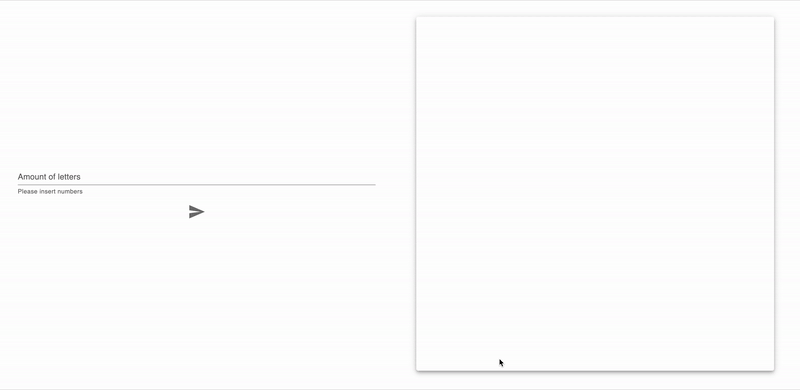

# fena-mail-sender 📬

## Description

This app uses http to trigger the process on `api service` and websocket to receive messages about emails statuses. 

There are two basic microservices wich handle the functionality: 
- `email-service` to send mocked emails
- `stats-service` to "collect" and transfer statistics

And one service who handle data from/to frontend: 
- `api service` 
### Frontend
    - react
    - material ui
    - socket.io
### Backend
    - nestjs
    - socket.io
    - kafka

## Launch
```
git clone git@github.com:AlimovaKatrin/fena-mail-sender.git
cd fena-mail-sender
docker-compose up -d --build 
```
